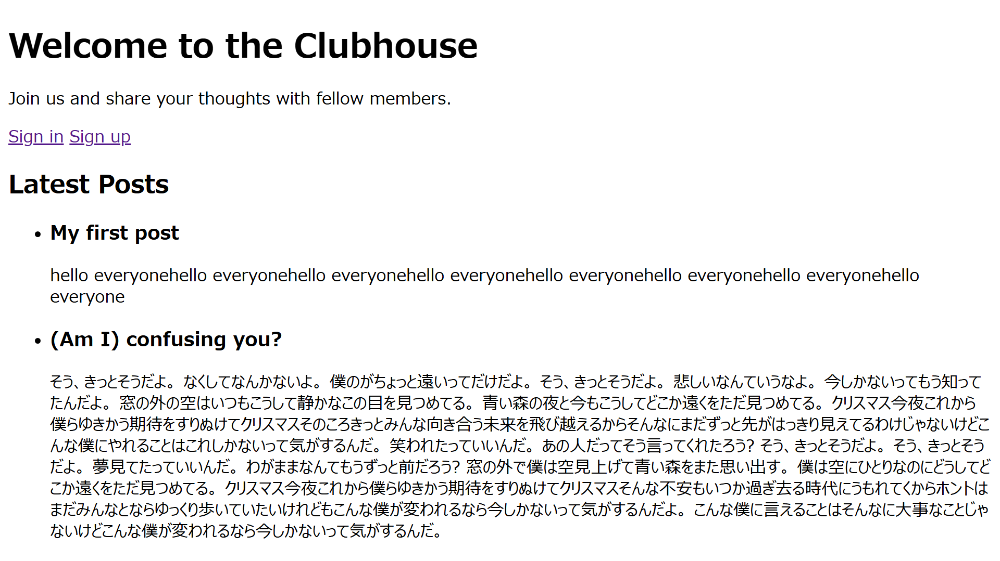
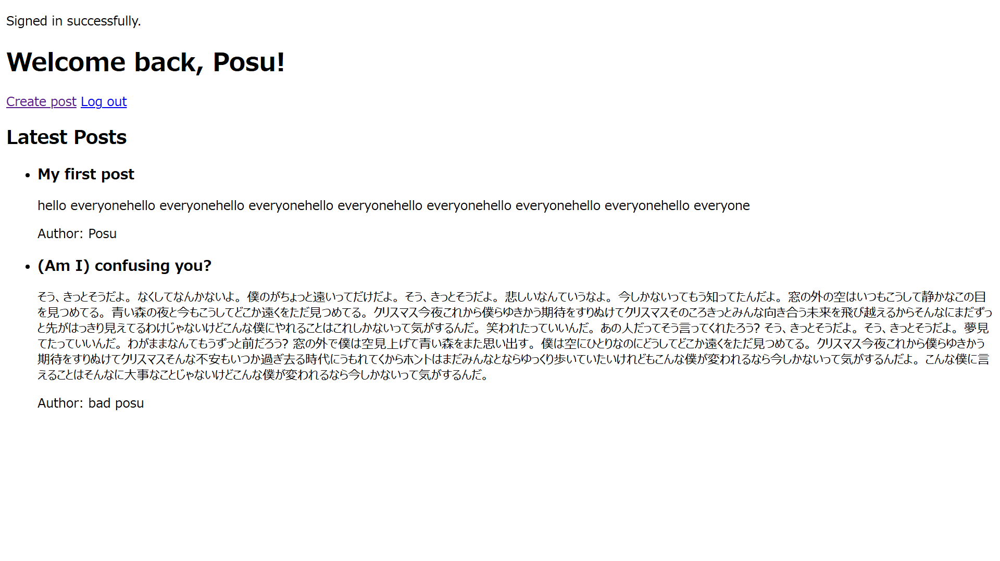

# Members Only

This is the project from [The Odin Project](https://github.com/TheOdinProject) curriculum — an exclusive clubhouse application built with **Ruby on Rails** and **Devise**, focusing on user authentication, sessions, associations, and authorization.

## Features

- User registration and login
- User logout and session management
- Create posts
- Associate posts with their authors
- Display posts to everyone
- Show post authors only to signed-in users
- Validate user and post data
- Protect authenticated actions with Devise

## Preview

### Login

**Before**

**After**

## Skills Learned

### Ruby on Rails

- User authentication with Devise
- Sessions, cookies, and authentication with Rails
- Controller filters
- Model associations
- Model validations
- Strong parameters
- RESTful routing
- CRUD operations
- Turbo
- ERB views and Rails form helpers

## Challenges

- Understanding how Devise handles authentication and sessions
- Connecting posts to the currently signed-in user
- Using `before_action` to restrict access to certain actions
- Understanding Strong Parameters with Devise
- Setting up model associations between users and posts
- Conditionally displaying post authors based on authentication status
- Getting familiar with Rails conventions
